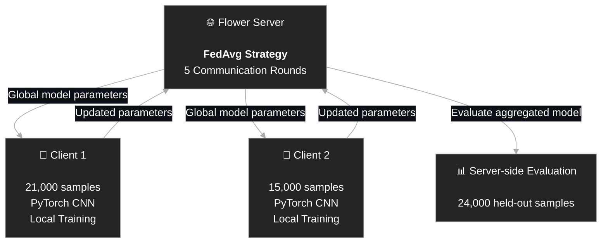

# Federated Learning Simulation with Flower and PyTorch

A containerized Federated Learning (FL) simulation built using **Flower, PyTorch, Docker, and MNIST**.

The project implements a central Flower server coordinating two independent client nodes. Each client performs local training on its own partition of the MNIST dataset, after which the server aggregates the locally trained models using **Federated Averaging (FedAvg)**.

## Overview

This project demonstrates the basic end-to-end workflow of Federated Learning:

1. A global model is initialized at the server.
2. Multiple clients connect to the Flower server.
3. The server distributes the current global model parameters.
4. Each client performs local training on its private dataset partition.
5. Clients return their updated model parameters.
6. The server aggregates the client models using FedAvg.
7. The aggregated global model is evaluated on a held-out dataset.
8. The process is repeated for multiple communication rounds.

The entire system runs as separate Docker containers connected through a Docker bridge network.

---
## System Architecture

